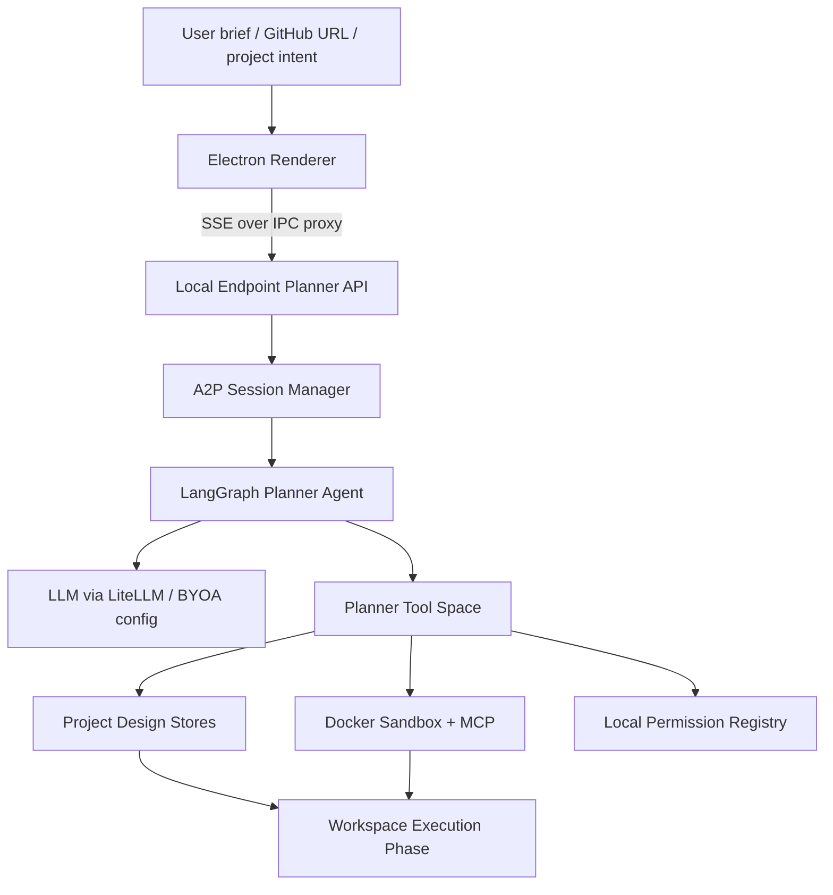

# OpenMAIC Pro Planner Overview

本文档全面介绍 OpenMAIC Pro Client 中的 Planner 模块。Planner 是系统的项目设计阶段，负责把用户的开放式自然语言意图转换为一个可以进入后续多智能体 Workspace 执行阶段的结构化项目。它不是单轮文本生成器，而是一个带阶段状态机、工具调用、人机确认、沙箱执行、持久化恢复和结构化产物写入的 Agent-to-Project 规划系统。

## 1. 模块定位

Planner 位于 OpenMAIC Pro 的前半段流程，承担“从想法到项目蓝图”的转换任务。

用户可以输入：

- 一个模糊兴趣，例如“我想做一个关于牛排的项目”
- 一个明确项目目标，例如“做一个多 PDF RAG 问答工具”
- 一个 GitHub 仓库链接，希望围绕现有代码设计学习项目
- 一个课程、论文、报告、模拟面试、沟通训练等非传统软件项目

Planner 的输出不是普通说明文，而是一组结构化项目资产：

- 项目标题、描述、标签和封面
- 项目阶段与里程碑
- 每个里程碑下的微任务
- 用户、AI 协作者、Instructor、Scene Actor 等角色
- 每个任务中的负责人、参与者和角色提示词
- starter files，即执行阶段可直接打开的初始文件
- learner-facing documents，即执行阶段可阅读或共同编辑的项目文档
- Instructor 的 persona 和 project knowledge
- 后续 Workspace 阶段需要消费的项目设计 JSON 状态

因此，Planner 的核心价值是把“我要做什么”变成“系统中多个智能体和用户可以怎么一起做”。

## 2. 代码位置

Planner 的主要实现分布如下：

| 路径 | 作用 |
|---|---|
| `endpoint/service/project_planner/agent.py` | LangGraph ReAct agent 主循环、工具调用、阶段跳转、token/cost/timing 统计、技能注入 |
| `endpoint/service/project_planner/session.py` | Planner session 生命周期、SSE stream、checkpoint 恢复、事件日志、状态管理 |
| `endpoint/service/project_planner/tools/phase.py` | 阶段工具定义，如 `finalize_brainstorm`、`finalize_blueprint`、`milestone_ready` |
| `endpoint/service/project_planner/tools/user_query.py` | 用户交互工具，如 `choose_user`、`ask_user`、`notify_user` |
| `endpoint/service/project_planner/tools/file_access.py` | 本地文件访问授权工具 |
| `endpoint/service/project_planner/tools/sandbox_fs.py` | 沙箱 starter files 读写工具 |
| `endpoint/service/project_planner/container.py` | Docker sandbox 生命周期管理 |
| `endpoint/service/project_planner/permissions.py` | 本地文件授权与安全校验 |
| `endpoint/service/project_planner/skills/` | Planner skill，包括 default、GitHub、mixed、AMD tutorials 等规划策略 |
| `endpoint/service/project_planner/tool_guidance/` | 对具体工具调用的强约束和写作规范 |
| `endpoint/api/project_planner.py` | `/project/planner/*` HTTP/SSE API |
| `endpoint/api/project_design/` | 项目结构化数据写入工具：project、issueboard、roles、documents、instructor |
| `src/renderer/pages/project/WorkspacePage.tsx` | legacy planner UI 的 SSE 消费和用户确认流程 |
| `src/renderer/components/planner/` | Planner 左右面板、确认面板、结构化视图 |

## 3. 总体架构

Planner 可以理解为四层架构：



### 3.1 Electron Renderer

前端只调用本地 endpoint，不直接调用远端 runtime 或 LLM provider。Planner 事件通过 SSE 流式返回，由主进程代理到 renderer，避免 CORS 和跨进程流式问题。

### 3.2 Local Endpoint

Endpoint 是 Planner 的本地服务层。它负责：

- 创建 project id 和 session
- 启动或恢复 Docker sandbox
- 编译 LangGraph agent
- 暴露 `/project/planner/create`、`/continue`、`/events`、`/{id}` 等 API
- 将内部 agent 事件翻译成客户端可消费的 SSE event
- 管理本地项目文件、权限和结构化 store

### 3.3 LangGraph Planner Agent

Planner agent 是一个 ReAct 风格的工具调用智能体。它的循环大致为：

```text
compact -> call_model -> should_continue -> call_tools -> compact ...
```

当上下文接近窗口上限时，`compact` 会总结旧消息，保留关键决策和当前项目状态。`call_model` 绑定当前阶段允许的工具并流式调用 LLM。`call_tools` 执行工具或触发用户中断。项目完成后，图退出。

### 3.4 Tool Space

Planner 的工具空间包括：

- 阶段工具
- 用户交互工具
- 项目元信息工具
- issueboard 工具
- roles 工具
- document 工具
- Instructor 配置工具
- cover generation 工具
- sandbox filesystem 工具
- file access 工具
- terminal/browser MCP 工具

这些工具共同定义了 Planner 可以采取的“规划动作空间”。

### 3.5 Docker Sandbox

Planner 可以启动每个项目独立的 Docker container。沙箱主要用于：

- GitHub repo clone 和分析
- terminal 命令执行
- browser / Playwright 检查
- starter files 生成
- 临时文件和项目 scaffold 处理

本地 workspace 和 starter-files 会挂载进沙箱，使 Planner 生成的资产可以进入后续 Workspace 阶段。

## 4. 阶段化规划流程

Planner 的标准流程由 `DEFAULT_PHASES` 定义：

```text
brainstorming -> project_info -> blueprint -> generation -> milestone_design -> completed
```

这个流程使 Planner 从粗到细逐步收敛，而不是在第一轮直接生成完整计划。

### 4.1 Brainstorming

目标：理解用户意图，收敛项目方向，确认项目骨架。

这一阶段会完成：

- 镜像用户输入，确认 Planner 理解了用户给出的具体信息
- 判断项目主题、目标产物和可执行方向
- 如果有 GitHub URL，先用浏览器快速预览，而不是立即 clone
- 必要时询问方向选择或歧义确认
- 询问用户熟练度：beginner、intermediate、advanced
- 形成初始项目骨架：project goal、final deliverable、high-level milestones
- 通过 `finalize_brainstorm` 触发 skeleton confirmation

这一阶段是用户交互最密集的阶段。后续阶段一般不再频繁打断用户。

### 4.2 Project Info

目标：写入稳定的项目元信息。

这一阶段通常会完成：

- `update_title`
- `update_description`
- `set_project_tags`
- `generate_cover`
- Instructor 初始项目知识或 persona 的部分准备

`finalize_project_info` 会校验必要项目字段和 required tag group 是否完整。

### 4.3 Blueprint

目标：设计项目蓝图，包括里程碑 shell 和角色体系。

这一阶段会完成：

- 创建顶层 milestones
- 设计 AI collaborator 角色
- 保持用户角色和 Instructor 角色为系统自动创建、不可随意改动
- 必要时创建 scene actor，用于面试、客服、谈判、沟通练习等角色扮演场景
- 根据学习目标和熟练度进行任务责任分配的前置规划

`finalize_blueprint` 会读取 issueboard 中的 milestone 列表，并建立 milestone queue。后续 `milestone_design` 会逐个设计每个 milestone 的微任务。

### 4.4 Generation

目标：生成项目执行阶段需要的 starter files 和必要文档。

Planner 会把代码、配置、fixtures、最小 README 等写入 starter-files。对于学习者真正要阅读、填写、共同编辑的材料，则通过 `publish_document` 写入文档系统，而不是随意写成 workspace 里的 Markdown 文件。

这一层区分很重要：

- starter-files 是 IDE / code surface
- documents 是 learner-facing document surface

`finalize_generation` 完成后，系统会弹出第一个 milestone，进入逐个 milestone 的微任务设计。

### 4.5 Milestone Design

目标：为每个 milestone 生成可执行微任务。

这一阶段由 runtime 注入当前 milestone 的上下文。Planner 需要为当前 milestone 一次性创建全部 microtasks，然后调用 `milestone_ready()`。

每个 microtask 包含：

- title
- description
- person_in_charge
- participants
- parent_milestone
- index
- role_prompts

`role_prompts` 是执行阶段多智能体协作的关键。它不是给用户看的普通描述，而是给 AI collaborator、Instructor 或 scene actor 的行为脚本，通常包含：

```text
## Observation
## Positive signal
## Corrective signal
## Silence rule
```

这让执行阶段的智能体知道何时观察、何时鼓励、何时纠偏、何时保持沉默。

### 4.6 Completed

当所有 milestone 都完成微任务设计后，runtime 会触发 `complete_project_design`。现在该工具不会直接结束项目，而是发出 `confirm_design` 中断，要求用户最终确认。

用户可以：

- approve：项目写入 `design_completed_at`，Planner 阶段永久完成
- reject：用户反馈返回给 Planner，Planner 继续修改设计

这形成了最终的人机闭环，防止 Planner 在用户未确认时直接进入执行阶段。

## 5. 人机协同机制

Planner 的人机交互不是普通聊天，而是工具化的 interrupt。

### 5.1 choose_user

`choose_user` 用于让用户在 2-5 个真实分支中选择。它通常用于：

- 方向选择
- 两种解释之间的歧义消解
- 熟练度选择
- proposal confirmation

前端会自动附加一个 Other / 其他 自由输入选项，因此 Planner 不需要自己添加 “Other” 选项。

### 5.2 ask_user

`ask_user` 现在更多是兼容事件名。新 prompt 主要使用 `choose_user`。在客户端协议层，它仍然表现为用户输入中断。

### 5.3 notify_user

`notify_user` 用于长操作中的进度通知，例如 clone repo、分析代码、生成文件等。它不会暂停 agent。

### 5.4 file_access_request

当 Planner 需要访问用户本地文件时，会触发授权中断。用户同意后：

- readonly：通过 `docker cp` 复制进 container，不会写回本地
- readwrite：通过 volume mount 挂载，需要重建 container

权限记录会持久化到每个项目的 `permissions.json`。

### 5.5 confirm_design

最终设计确认中断。它将 `complete_project_design` 从“直接结束”变成“请求用户确认”。这是 Planner 的关键安全闸门。

## 6. 学习导向的规划策略

Planner 的一个重要特点是：它不是以工作分工为中心，而是以用户学习为中心。

### 6.1 用户熟练度

Planner 会基于用户熟练度调整项目规模和任务分配：

| proficiency | milestones | microtasks/milestone | 用户承担比例 |
|---|---:|---:|---|
| beginner | 2-4 | 2-3 | 较少，AI 承担更多脚手架 |
| intermediate | 3-5 | 3-4 | 中等，用户和 AI 协作 |
| advanced | 4-6 | 3-5 | 较多，用户承担核心任务 |

这不是只改变文案，而是影响 milestone 数量、microtask 数量和 person_in_charge 的分配。

### 6.2 核心学习任务与非核心任务

Planner 在设计任务时会区分：

- core-learning：用户必须亲自完成，否则无法获得关键能力
- non-core / dirty work：配置、脚手架、重复 glue work，可由 AI collaborator 完成
- redundant：不值得进入项目设计的任务

这种分类使 AI 不会简单替用户完成一切，而是承担辅助、脚手架、演示、检查、研究等任务，把关键学习动作留给用户。

### 6.3 Academic Deliverable 规则

如果项目是论文、作业、课程报告、毕业设计、开题报告等学术交付物，Planner 会启用更严格的规则：

- 任何直接产出或编辑提交文本的 microtask 必须由用户负责
- AI collaborator 不能代写、改写、润色用户要提交的正文
- Instructor 可以提供结构建议、相邻示例、问题引导、引用规范等支持

这使 Planner 在项目式学习场景中内置学术诚信约束。

### 6.4 Scene Actor

对于模拟面试、客户沟通、谈判、心理咨询、客服训练等“对话本身就是学习对象”的项目，Planner 可以创建 scene actor。

Scene actor 与 collaborator 不同：

- collaborator 负责做事、写文件、跑工具
- Instructor 负责指导和纠偏
- scene actor 负责扮演一个具体情境人物，与用户进行沉浸式互动

这扩展了 Planner 能支持的项目类型，使它不仅能规划软件项目，也能规划沟通、表达、面试和角色扮演类项目。

## 7. Skill 机制

Planner 使用 skill 来封装不同规划策略。skill 是 Markdown 文件，包含 YAML frontmatter 和系统提示词。

当前主要 skill 包括：

- `generate-project/default`：从零开始生成项目
- `generate-project/github`：基于 GitHub 仓库生成项目
- `generate-project/mixed`：混合输入场景
- `generate-project/amd-tutorials`：针对 AMD / ROCm 官方来源的隐藏 skill

Agent 会把可用 skill catalog 注入系统 prompt，并允许模型通过 `use_skill` 激活具体 skill。

### 7.1 Default Skill

Default skill 假设用户没有提供可 clone 的仓库。它将任何输入都转换成可执行项目，即使输入很模糊或看起来不像项目请求。

例如：

- “我想吃牛排”会被转换成一个具体可执行的牛排烹饪和风味比较项目
- “我很无聊”会被转换成一个可完成的探索或创作项目

这体现了 Planner 的“project-shaped interpretation”原则。

### 7.2 GitHub Skill

GitHub skill 用于用户提供仓库链接的情况。它采用两阶段 repo access：

1. Round 1 只使用 browser preview，快速读取仓库标题、README 和 about 信息，尽快给用户方向反馈
2. 方向和熟练度确认后，才 clone 到 `/home/sandbox/workspace/src/` 做深度分析

这样可以避免用户第一轮等待 10-30 秒 clone，同时确保最终 blueprint 有真实代码依据。

### 7.3 Tool Guidance

`tool_guidance` 为每个工具补充详细约束，例如：

- `create_microtask` 必须带 role_prompts
- `create_role` 不能创建 user 或 Instructor，因为它们是锁定角色
- `publish_document` 只能发布 learner-facing content，不能发布 Planner 过程总结
- `choose_user` 不能添加自定义 Other，因为前端会自动追加
- `generate_cover` 必须提供具体视觉元素

这些 guidance 实际上是 Planner 的“操作规范层”，用于减少 LLM 工具调用中的漂移和错误。

## 8. 沙箱与文件权限

Planner 使用 Docker container 来隔离项目分析和文件生成。

### 8.1 Container 生命周期

每个项目对应一个 sandbox container：

```text
openmaic-sandbox-{project_id}
```

默认镜像：

```text
danielznn16/project-planner-ubuntu-24.04:latest
```

container 内运行 MCP proxy，暴露 terminal、browser 等工具能力。

### 8.2 挂载目录

核心路径：

```text
Host ~/.openmaicpro/planner/{project_id}/workspace/
  -> Container /home/sandbox/workspace/

Host ~/.openmaicpro/planner/{project_id}/setup/starter-files/
  -> Container /home/sandbox/starter-files/
```

`workspace` 用于 repo clone 和中间分析，`starter-files` 用于最终交付给执行阶段的初始代码或文件。

### 8.3 文件访问授权

Planner 默认不能随意读取用户本地文件。需要访问时，必须通过 `request_file_access` 触发用户确认。

安全策略包括：

- path 必须是 absolute path
- 文件或目录必须存在
- blocklist 禁止暴露 `.ssh`、`.aws`、`.openmaicpro`、`/etc`、`/proc` 等敏感路径
- readonly 和 readwrite 分开处理
- grant 会持久化，便于 session 恢复

## 9. SSE 事件协议

Planner 通过 SSE 向前端报告状态。主要事件如下：

| 事件 | 含义 |
|---|---|
| `project_id` | 创建项目后的第一个事件，前端保存 project id |
| `tool_call` | Agent 调用了某个工具 |
| `tool_result` | 工具执行完成 |
| `thinking_delta` | 模型 reasoning / thinking 流式片段 |
| `token_usage` | token 和 cost 统计 |
| `ask_user` | 用户输入中断 |
| `ask_user_end` | 用户回答后恢复 |
| `file_access_request` | 本地文件权限请求 |
| `cover_prompt` | 生成封面图提示词 |
| `cover_image` | 生成的封面图 base64 |
| `file_tree` | starter-files 或 documents 目录变化 |
| `confirm_design` | 最终设计确认请求 |
| `design_completed` | 项目设计正式完成 |
| `done` | 当前 stream 结束 |
| `error` | 发生错误 |

事件有两个重要作用：

1. 让 UI 实时展示 Planner 正在做什么
2. 形成可恢复、可 replay 的 event log

## 10. 持久化与恢复

Planner 支持长流程恢复，避免 endpoint 重启或 LLM 错误导致项目丢失。

### 10.1 Session Metadata

每个项目会持久化 `session.json`，包含：

- session id
- project id
- thread id
- status
- pending interrupt
- event log
- token usage
- total cost
- system prompt
- auto_accept

### 10.2 LangGraph Checkpoint

Planner 使用 `AsyncSqliteSaver` 将 LangGraph checkpoint 存储在：

```text
~/.openmaicpro/planner/{project_id}/setup/checkpoints.db
```

这使 Planner 可以从上一次图状态继续运行，而不是重新开始。

### 10.3 Restore Sessions

endpoint 启动时会扫描 planner 目录，恢复未完成项目：

- 如果项目已经 `design_completed_at`，清理旧 session
- 如果存在 pending interrupt，恢复到 `waiting_user` 或 `waiting_grant`
- 如果上次处于 running/error 但没有 pending interrupt，恢复为 idle，并标记 `needs_resume`

### 10.4 Event Replay

`/project/planner/events` 支持根据 event index replay。前端重连时可以请求 missed events，恢复 UI 状态。

## 11. 可靠性设计

Planner 针对长时间 agent loop 做了多项可靠性处理。

### 11.1 Message Compaction

当估算 token 数超过 context window 的 75% 时，系统会总结旧消息，保留：

- 已做决定
- 当前项目状态
- 当前 pipeline phase
- 用户约束
- pending questions

这样 Planner 能运行多轮复杂规划而不轻易爆上下文。

### 11.2 LLM Retry

对于 429、500、502、503、529 等 transient provider error，Planner 会指数退避重试，最多 10 次。

### 11.3 Tool Call Pairing 修复

Anthropic 类模型要求每个 tool call 都有对应 tool result。如果进程在工具调用和结果写入之间崩溃，恢复时可能出现不合法消息历史。Planner 会扫描消息并为缺失结果的 tool call 注入 synthetic abort result，使模型可以继续恢复。

### 11.4 Redirect Guard

Planner 不允许模型直接给用户发裸文本。它必须通过 `notify_user`、`choose_user` 等工具沟通。如果模型连续输出裸文本，系统会注入 redirect message。超过次数后，会把文本包装成 `notify_user`，避免无限循环。

### 11.5 Phase Tool Whitelist

不同阶段会限制可用工具。例如用户交互工具主要只在 brainstorming 阶段可用，后续阶段物理上从工具集中移除，防止 Planner 在 blueprint/generation 阶段频繁打断用户。

### 11.6 Token、Cost 和 Timing

Planner 会记录：

- input tokens
- output tokens
- thinking tokens
- estimated cost
- first token latency
- LLM call duration
- tool call timing
- turn id
- phase
- active skill

这些数据可用于后续性能分析和论文实验。

## 12. API Surface

主要 client-facing API：

| API | 作用 |
|---|---|
| `POST /project/planner/create` | 从用户 brief 创建项目并启动 Planner |
| `POST /project/planner/continue` | 用户回答、授权、确认后恢复 Planner |
| `POST /project/planner/events` | replay event log |
| `GET /project/planner/health` | 检查 Docker、模型、MCP readiness |
| `GET /project/planner/sessions` | 列出 active sessions |
| `GET /project/planner/projects` | 项目 gallery |
| `GET /project/planner/{project_id}` | 完整项目详情 |
| `GET /project/planner/{project_id}/status` | session 状态 |
| `GET /project/planner/{project_id}/history` | 消息历史 |
| `GET /project/planner/{project_id}/project` | project + issueboard snapshot |
| `GET /project/planner/{project_id}/milestones` | milestones |
| `GET /project/planner/{project_id}/roles` | roles |
| `GET /project/planner/{project_id}/documents` | documents |
| `GET /project/planner/cover/{project_id}` | cover image |
| `DELETE /project/planner/{project_id}` | 删除项目并清理 container/session |

## 13. 与 Workspace 的关系

Planner 输出的是 Workspace 的输入。

Planner 阶段完成后，系统进入执行阶段。Workspace 会读取 Planner 生成的：

- milestones
- microtasks
- roles
- documents
- starter files
- role prompts
- Instructor 配置

每个 role 可以在 Workspace 中拥有自己的 session。用户、AI collaborator、Instructor 和 scene actor 会围绕 Planner 生成的微任务展开协作。

换句话说：

```text
Planner 负责设计协作结构
Workspace 负责运行协作过程
```

Planner 的设计质量直接决定 Workspace 中多智能体协作是否可执行、是否符合用户学习目标、是否不过度代劳。

## 14. Gateway 方向

Planner 现在还有一个 Planner Gateway 设计方向。目标是在不改变客户端 API 的情况下，把 agent loop runtime 从本地 endpoint 中抽象出来。

目标拓扑：

```text
Electron Client -> Local Endpoint Gateway -> Local Runtime / Official Runtime
```

关键原则：

- 客户端永远只调用本地 endpoint
- 本地 endpoint 保持 client-facing API 稳定
- runtime 可以是本地，也可以是 official MAIC endpoint
- 本地 filesystem、Docker、权限、project store 仍由本地 gateway 执行
- official runtime 不直接访问用户文件和 Docker

这种架构为未来云端模型额度、官方 runtime、BYOA runtime 共存提供基础。

## 15. 可作为论文贡献点的总结

Planner 可以被抽象为一个面向项目式学习的 Agent-to-Project 系统。它的主要贡献可以总结为以下四点。

### 15.1 Structured Agent-to-Project Planning

Planner 将用户的开放式自然语言需求转换为结构化、可执行、可恢复的项目资产，而不是输出静态文本计划。

### 15.2 Phase-Gated Human-in-the-Loop Workflow

Planner 使用阶段状态机和用户确认中断，将项目设计拆成多个可控阶段，并在关键节点允许用户修正方向，降低 LLM 自作主张和错误定稿的风险。

### 15.3 Learning-Aware Role and Task Synthesis

Planner 根据用户熟练度、学习目标、任务核心性和学术诚信规则，合成用户、AI collaborator、Instructor、scene actor 的任务分工和行为提示词，使 AI 支持学习而不是替代学习。

### 15.4 Sandboxed Tool-Augmented Planning

Planner 可以在 Docker sandbox 中分析仓库、运行命令、生成 starter files，并通过权限系统安全访问本地文件。这使它能够基于真实代码和文件环境进行项目规划。

### 15.5 Persistent and Observable Long-Running Agent Runtime

Planner 通过 checkpoint、event log、token/cost/timing 统计、retry、compaction 和恢复机制支持长时间复杂 agent workflow，并为后续实验评估提供观测数据。

## 16. 可评估指标

如果将 Planner 单独写成论文，可以围绕以下维度设计实验或案例分析。

### 16.1 规划完整性

衡量 Planner 是否生成完整项目资产：

- 是否有明确 title/description
- 是否有合理 milestone 数量
- 是否每个 milestone 有 microtasks
- 是否创建必要 roles
- 是否生成 starter files 或 documents
- 是否每个非用户角色有 role_prompts

### 16.2 可执行性

衡量计划是否能在 Workspace 中执行：

- microtask 是否有明确负责人
- 任务是否依赖现有 client 能力
- collaborator-owned task 是否能通过 sandbox、files、documents、browser 等工具完成
- manual/physical task 是否要求用户提供 observable evidence

### 16.3 学习适配性

衡量任务分配是否符合用户熟练度和学习目标：

- beginner 是否避免过多用户主责任务
- advanced 是否保留足够核心任务给用户
- core-learning 任务是否由用户承担
- AI 是否承担脚手架和非核心工作

### 16.4 用户确认质量

衡量人机交互是否有效：

- Round 1 是否准确 mirror 用户输入
- 是否只询问用户无法推断的信息
- 是否避免重复选项和无意义确认
- skeleton lock 后是否减少不必要打断

### 16.5 稳定性

衡量长流程可靠性：

- endpoint 重启后是否可恢复
- pending interrupt 是否可恢复
- event replay 是否能恢复 UI
- LLM transient error 是否能 retry
- context compaction 后是否保持设计一致性

### 16.6 成本与延迟

衡量系统效率：

- first token latency
- total planning time
- tool call count
- LLM turn count
- total tokens
- total cost
- GitHub project 中 browser-preview-before-clone 是否降低首轮等待

## 17. 当前边界与限制

Planner 当前仍有一些边界。

1. 它依赖 LLM 工具调用遵守 prompt 和 tool guidance，虽然有 validation 和 redirect，但仍可能出现语义层面的规划失误。
2. 没有统一全局状态库，前端部分状态由 localStorage 和组件状态维护。
3. 部分测试存在，但仓库根部没有完整 lint/test suite 配置。
4. Gateway 方向已有设计和部分代码，但完整 official runtime 分离仍属于演进方向。
5. Planner 的质量评估目前更多依赖 contract tests、stability scripts 和人工验收，尚未形成完整论文式 benchmark。

## 18. 一句话总结

OpenMAIC Pro Planner 是一个面向项目式学习的交互式规划智能体。它通过阶段化流程、人机确认、技能化 prompt、结构化工具调用、安全沙箱、持久化恢复和学习导向任务分配，将用户的开放式意图转化为可执行的多智能体项目工作区蓝图。
